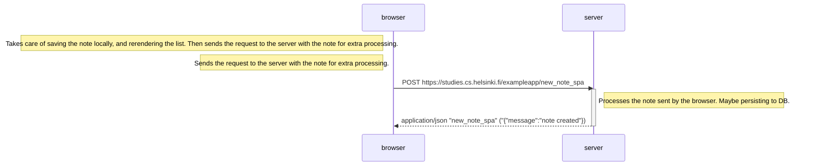

```mermaid
    sequenceDiagram
        participant browser
        participant server

        Note left of browser: Takes care of saving the note locally, and rerendering the list. Then sends the request to the server with the note for extra processing.
        Note left of browser: Sends the request to the server with the note for extra processing.
        browser->>server: POST https://studies.cs.helsinki.fi/exampleapp/new_note_spa
        activate server
        Note right of server: Processes the note sent by the browser. Maybe persisting to DB.
        server-->>browser: application/json "new_note_spa" ("{"message":"note created"})
        deactivate server
```
